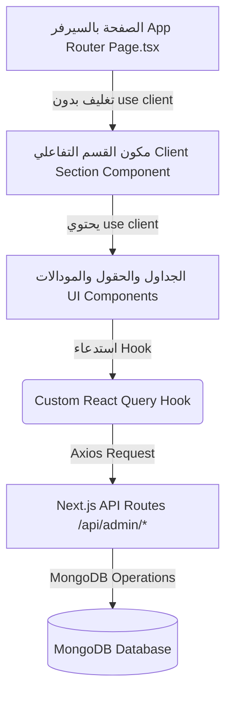

# 🗺️ ربط مكونات الأدمن بالـ Hooks واللوجيك لـ "شحنتك" (Shahntak Admin Components & Hooks Mapping)

يهدف هذا المستند إلى توثيق الربط الكامل والدقيق بين **صفحات السيرفر (Next.js Server Components)** ومكونات الواجهة التفاعلية (**Client Components**) والـ **Custom Hooks الـ 13** المبنية في مشروع **"شحنتك"**.

---

## 🏛️ 1. القاعدة الهيكلية لتوزيع الكود (Server Component vs. Client Component Rule)

* **صفحات مسارات الأب مستندات السيرفر (`app/admin/(pages)/*/page.tsx`)**:
  * تكون دائماً **Server Components** (بدون directive `"use client"`).
  * مسؤولة عن إعداد عنوان الصفحة (SEO Meta) وتغليف الواجهة فقط.
* **مكونات الأقسام التفاعلية (`components/admin/{domain}/*`)**:
  * تحتوي على الموجّه **`"use client"`** في بداية الملف.
  * تضم الجداول، المودالات، الـ Custom Hooks، التفاعل، الـ React Hook Form، والـ State الكامل.

---

## 🏗️ 2. خريطة ربط الواجهات والصفحات بالمكونات التفاعلية (Section & Component Mapping)

### 🏢 1. قسم الشركات المسجلة والمشتريات (`app/admin/(pages)/companies/`)
* **صفحة السيرفر (`app/admin/(pages)/companies/page.tsx`)**: تنادي المكون التفاعلي `<CompaniesSection />`.
* **مكونات العميل التفاعلية (`components/admin/companies/`)**:
  | المكون (Component) | الـ Hooks المستخدمة | اللوجيك والدور الوظيفي اللوجستي |
  | :--- | :--- | :--- |
  | **`CompaniesSection.tsx`** | - | المكون التفاعلي الرئيسي المحتوي لـ `"use client"` ومجسم قسم الشركات. |
  | **`CompaniesTable.tsx`** | `useCompanies`, `useDeleteCompany`, `useUpdateCompanyStatus` | عرض جدول الشركات المقسم، التصفية حسب الحالة (`active`, `banned`, `archived`)، وتجميد/حذف الشركة. |
  | **`CompanyDetailsModal.tsx`** | `useCompany` | عرض التفاصيل الكاملة للشركة (البيانات الضريبية والسجل التفاعلي). |
  | **`ApproveCompanyCard.tsx`** | `useApproveCompany` | تسجيل موافقة أدمن المنصة وتوثيق المعرف `approvedBy` وتاريخ الموافقة. |
  | **`CompanyFormModal.tsx`** | `useCreateCompany`, `useUpdateCompany` | إضافة شركة جديدة أو تحديث بياناتها بالمرتبطة مع `companies.schema.ts`. |

---

### 👥 2. قسم موظفي الشركات والصلاحيات (`app/admin/(pages)/company-users/`)
* **صفحة السيرفر (`app/admin/(pages)/company-users/page.tsx`)**: تنادي المكون التفاعلي `<CompanyUsersSection />`.
* **مكونات العميل التفاعلية (`components/admin/companyUsers/`)**:
  | المكون (Component) | الـ Hooks المستخدمة | اللوجيك والدور الوظيفي اللوجستي |
  | :--- | :--- | :--- |
  | **`CompanyUsersSection.tsx`**| - | المكون التفاعلي الرئيسي المحتوي لـ `"use client"`. |
  | **`CompanyUsersTable.tsx`** | `useCompanyUsers`, `useDeleteCompanyUser` | استعراض موظفي ومسؤولي شركات الشحن وإدارة حالات الحسابات. |
  | **`CompanyUserFormModal.tsx`**| `useCreateCompanyUser`, `useUpdateCompanyUser` | إنشاء حساب موظف وتعيين الشركة التابع لها (`companyId`) مع `companyUser.schema.ts`. |
  | **`UserPermissionsModal.tsx`**| `useUpdateCompanyUserRoleAndPermissions` | تعديل دور الموظف (`owner`, `manager`, `staff`) وتحديث قائمة الصلاحيات (`permissions`). |

---

### 🚚 3. قسم الناقلين المتعاقد معهم (`app/admin/(pages)/carriers/`)
* **صفحة السيرفر (`app/admin/(pages)/carriers/page.tsx`)**: تنادي المكون التفاعلي `<CarriersSection />`.
* **مكونات العميل التفاعلية (`components/admin/carriers/`)**:
  | المكون (Component) | الـ Hooks المستخدمة | اللوجيك والدور الوظيفي اللوجستي |
  | :--- | :--- | :--- |
  | **`CarriersSection.tsx`** | - | المكون التفاعلي الرئيسي المحتوي لـ `"use client"`. |
  | **`CarriersList.tsx`** | `useCarriers`, `useToggleCarrierStatus`, `useDeleteCarrier` | عرض الناقلين المحليين والـ API الخارجية وتفعيل/تعطيل الناقل الفوري. |
  | **`CarrierFormModal.tsx`** | `useCreateCarrier`, `useUpdateCarrier` | إضافة شركة نقل جديدة أو تعديل بيانات الاتصال المرتبطة مع `carrier.schema.ts`. |

---

### 🚛 4. قسم الأسطول والشاحنات (`app/admin/(pages)/vehicles/`)
* **صفحة السيرفر (`app/admin/(pages)/vehicles/page.tsx`)**: تنادي المكون التفاعلي `<VehiclesSection />`.
* **مكونات العميل التفاعلية (`components/admin/vehicles/`)**:
  | المكون (Component) | الـ Hooks المستخدمة | اللوجيك والدور الوظيفي اللوجستي |
  | :--- | :--- | :--- |
  | **`VehiclesSection.tsx`** | - | المكون التفاعلي الرئيسي المحتوي لـ `"use client"`. |
  | **`VehiclesGrid.tsx`** | `useVehicles`, `useDeleteVehicle` | استعراض مركبات الأسطول والشاحنات ونوع كل مركبة والحالة التشغيلية. |
  | **`VehicleCapacitiesModal.tsx`** | `useUpdateVehicleCapacities` | ضبط سعات الأسطول القصوى للوزن والحجم (`capacityWeight`, `capacityVolume`). |
  | **`VehicleFormModal.tsx`** | `useCreateVehicle`, `useUpdateVehicle` | إضافة شاحنة جديدة للأسطول أو تحديث مواصفاتها مع `vehicle.schema.ts`. |

---

### 🗺️ 5. قسم المسارات والخطوط اللوجستية (`app/admin/(pages)/routes/`)
* **صفحة السيرفر (`app/admin/(pages)/routes/page.tsx`)**: تنادي المكون التفاعلي `<RoutesSection />`.
* **مكونات العميل التفاعلية (`components/admin/routes/`)**:
  | المكون (Component) | الـ Hooks المستخدمة | اللوجيك والدور الوظيفي اللوجستي |
  | :--- | :--- | :--- |
  | **`RoutesSection.tsx`** | - | المكون التفاعلي الرئيسي المحتوي لـ `"use client"`. |
  | **`RoutesTable.tsx`** | `useRoutes`, `useDeleteRoute` | عرض المسارات والخطوط اللوجستية بين مدن المملكة وتحديث حالة خط السير. |
  | **`RoutePricingModal.tsx`** | `useUpdateRoutePricing` | ضبط أسعار الشحن الأساسية لتقاطع المدن والزمن التقديري للوصول (`estimatedTransitTime`). |
  | **`RouteFormModal.tsx`** | `useCreateRoute`, `useUpdateRoute` | إنشاء خط سير لوجستي جديد أو تعديل نقطة البداية والنهاية ورابط الناقل مع `route.schema.ts`. |

---

### 📦 6. قسم الطلبات والتجميع (`app/admin/(pages)/orders/`)
* **صفحة السيرفر (`app/admin/(pages)/orders/page.tsx`)**: تنادي المكون التفاعلي `<OrdersSection />`.
* **مكونات العميل التفاعلية (`components/admin/orders/`)**:
  | المكون (Component) | الـ Hooks المستخدمة | اللوجيك والدور الوظيفي اللوجستي |
  | :--- | :--- | :--- |
  | **`OrdersSection.tsx`** | - | المكون التفاعلي الرئيسي المحتوي لـ `"use client"`. |
  | **`OrdersTable.tsx`** | `useOrders`, `useDeleteOrder` | استعراض الطلبات الفردية والجماعية المنشأة من الشركات مع الدفع عند الاستلام (COD). |
  | **`BulkUploadOrdersModal.tsx`**| `useBulkUploadOrders` | الرفع الجماعي للطلبات عبر ملفات Excel/CSV وتدقيق بيانات المستلمين. |
  | **`GroupOrdersModal.tsx`** | `useGroupOrdersToShipment` | تجميع الطلبات الفردية المحددة وتحويلها إلى شحنة رئيسية واحدة (`shipmentId`). |
  | **`OrderFormModal.tsx`** | `useCreateOrder`, `useUpdateOrder` | إضافة طلب فردي يدوي وتحديد بيانات المستلم والوزن والقيمة مع `order.schema.ts`. |

---

### 🚛 7. قسم الشحنات وتعيين الموارد (`app/admin/(pages)/shipments/`)
* **صفحة السيرفر (`app/admin/(pages)/shipments/page.tsx`)**: تنادي المكون التفاعلي `<ShipmentsSection />`.
* **مكونات العميل التفاعلية (`components/admin/shipments/`)**:
  | المكون (Component) | الـ Hooks المستخدمة | اللوجيك والدور الوظيفي اللوجستي |
  | :--- | :--- | :--- |
  | **`ShipmentsSection.tsx`** | - | المكون التفاعلي الرئيسي المحتوي لـ `"use client"`. |
  | **`ShipmentsTable.tsx`** | `useShipments`, `useDeleteShipment` | متابعة الشحنات الرئيسية (`ftl`, `ltl`, `local_delivery`) وحالات خط السير. |
  | **`AssignResourcesModal.tsx`** | `useAssignShipmentResources` | ربط وتعيين المسار (`routeId`) والناقل (`carrierId`) والمركبة (`vehicleId`) للشحنة. |
  | **`UpdateShipmentStatusModal.tsx`**| `useUpdateShipmentStatus` | تغيير حالة الشحنة التشغيلية (`in_transit`, `delivered`, `picked_up`, إلخ). |
  | **`ShipmentFormModal.tsx`** | `useCreateShipment`, `useUpdateShipment` | إنشاء شحنة رئيسية جديدة أو تعديل نقاط المنشأ والوجهة والتكاليف مع `shipment.schema.ts`. |

---

### 💳 8. قسم الفواتير والمدفوعات (`app/admin/(pages)/invoices/` & `payments/`)
* **صفحات السيرفر (`app/admin/(pages)/invoices/page.tsx` & `payments/page.tsx`)**.
* **مكونات العميل التفاعلية (`components/admin/invoices/` & `payments/`)**:
  | المكون (Component) | الـ Hooks المستخدمة | اللوجيك والدور الوظيفي اللوجستي |
  | :--- | :--- | :--- |
  | **`InvoicesSection.tsx`** | - | المكون التفاعلي الرئيسي المحتوي لـ `"use client"`. |
  | **`InvoicesTable.tsx`** | `useInvoices`, `useUpdateInvoiceStatus`, `useDeleteInvoice` | متابعة الفواتير اللوجستية الصادرة وحالات الدفع (`draft`, `issued`, `paid`, `overdue`). |
  | **`PaymentsHistory.tsx`** | `usePayments`, `useDeletePayment` | استعراض سجل المدفوعات وإثباتات التحويلات البنكية والسداد. |
  | **`RecordPaymentModal.tsx`** | `useCreatePayment` | إثبات سداد فاتورة وتحديث توازن مدفوعات الشركة وتحديث حالة الفاتورة تلقائياً إلى `paid`. |

---

### 📍 9. قسم تتبع الشحنات اللحظي (`app/admin/(pages)/tracking/`)
* **صفحة السيرفر (`app/admin/(pages)/tracking/page.tsx`)**: تنادي المكون التفاعلي `<TrackingSection />`.
* **مكونات العميل التفاعلية (`components/admin/tracking/`)**:
  | المكون (Component) | الـ Hooks المستخدمة | اللوجيك والدور الوظيفي اللوجستي |
  | :--- | :--- | :--- |
  | **`TrackingSection.tsx`** | - | المكون التفاعلي الرئيسي المحتوي لـ `"use client"`. |
  | **`ShipmentTimeline.tsx`** | `useShipmentTrackingEvents` | عرض الخط الزمني الخارجي والداخلي لحركة الشحنة ونقاط التتبع الجغرافية. |
  | **`LogTrackingEventModal.tsx`**| `useLogTrackingEvent`, `useDeleteTrackingEvent` | إضافة حدث تتبع جديد بموقع جغرافي وتحديث حالة الشحنة التابعة تلقائياً. |

---

## 🔄 3. دورة الفصل المعماري (Architecture Flow)

---
*تم اعتماد هذه القاعدة كقاعدة معمارية صريحة لجميع صفحات ومكونات لوحة تحكم شحنتك.*
