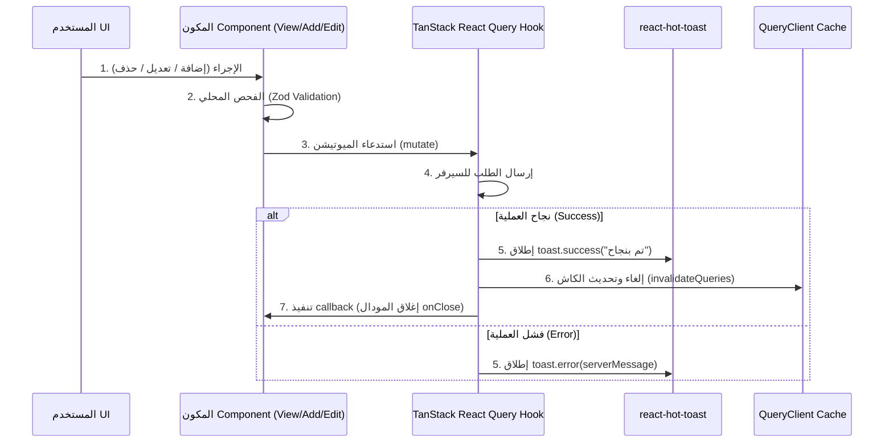

# 📘 الدليل القياسي الموحد لسكاشن الأدمن (`Add` - `Edit` - `View` - `Details`)

هذا المستند يُحدد **الطريقة القياسية والموحدة (Standardized Blueprint)** لعمل جميع السكاشن والمكونات داخل مجلد `components/admin/sections/` (مثل: `users`, `clinics`, `doctors`, `plans`, `companies`, `invoices`, `vehicles`...) في أي مشروع **Next.js**.

يغطي الدليل دورة العمل الكاملة للـ **CRUD**:
1. **`View` (الصفحة والجدول الرئيسي)**: الإحصائيات، الجدول، البحث، الفلترة، التصفح، والتحميل.
2. **`Add` (مودال الإضافة)**: النمذجة، التحقق Zod Validation، التحميل، وـ Success Toast.
3. **`Edit` (مودال التعديل)**: تهيئة البيانات الأولية، التعديل، التحميل، وـ Success Toast.
4. **`Details` (مودال التفاصيل)**: العرض المنظم، البادجات، والتنسيق الزمني.

---

## 🏗️ 1. المخطط المعماري الموحد لتدفق البيانات (Unified Data Architecture)



---

## 📺 2. مكون العرض والجدول الرئيسي (`[Entity]s.tsx` / Main View)

المكون المسؤول عن استدعاء الـ Hooks، رندر الإحصائيات، البحث والفلترة، رندر الجدول، وإدارة فتح وإغلاق المودالات الثلاثة ومودال تأكيد الحذف.

```tsx
// components/admin/sections/users/Users.tsx (مثال قياسي معمم)
"use client";

import React, { useState, useMemo } from "react";
import Loading from "@/components/ui/loading";
import ErrorMessege from "@/components/ui/ErrorMessege";
import EmptyData from "@/components/ui/EmptyData";
import ConfirmDeletePopup from "@/components/ui/ConfirmDeletePopup";
import { getStatusColor, getStatusText } from "@/components/ui/Badge";
import { getErrorMessage } from "@/utils/getErrorMessage";
import { useUsers, useDeleteUserMutation } from "@/hooks/admin/useUser";
import AddUser from "./AddUser";
import EditUser from "./EditUser";
import DetailsUser from "./DetailsUser";
import { TbRefresh, TbSquareRoundedPlus, TbSearch, TbInfoCircle, TbPencil, TbTrash } from "react-icons/tb";

export default function Users() {
  // 1. حالات التصفح والبحث
  const [page, setPage] = useState(1);
  const [searchQuery, setSearchQuery] = useState("");
  const [filterStatus, setFilterStatus] = useState("all");
  const limit = 10;

  // 2. حالات المودالات الموحدة
  const [isAddOpen, setIsAddOpen] = useState(false);
  const [isEditOpen, setIsEditOpen] = useState(false);
  const [isDetailsOpen, setIsDetailsOpen] = useState(false);
  const [selectedUser, setSelectedUser] = useState<any>(null);
  const [userToDeleteId, setUserToDeleteId] = useState<string | null>(null);

  // 3. الاستعلامات والميوتيشن
  const { data: usersRes, isLoading, isError, error, refetch, isFetching } = useUsers(page, limit, searchQuery, filterStatus);
  const { mutate: deleteUser, isPending: isDeleting } = useDeleteUserMutation();

  // 4. إعادة التصفح للصفحة الأولى عند البحث أو الفلترة
  const handleSearchChange = (e: React.ChangeEvent<HTMLInputElement>) => {
    setSearchQuery(e.target.value);
    setPage(1); // Reset to page 1
  };

  const handleStatusFilterChange = (status: string) => {
    setFilterStatus(status);
    setPage(1); // Reset to page 1
  };

  // 5. معالجة التحميل الأولي
  if (isLoading) return <Loading />;

  return (
    <section className="p-6 text-right" dir="rtl">
      {/* معالجة أخطاء الاستعلام الجانبي */}
      {isError && <ErrorMessege message={getErrorMessage(error)} />}

      {/* الهيدر والأزرار الرئيسية */}
      <div className="flex flex-col sm:flex-row justify-between items-center gap-4 mb-6">
        <h1 className="text-xl font-bold text-foreground">إدارة المستخدمين</h1>
        <div className="flex items-center gap-2">
          {/* زر التحديث مع الدوران اللحظي */}
          <button onClick={() => refetch()} disabled={isFetching} className="p-2 border rounded hover:bg-gray-100 disabled:opacity-50">
            <TbRefresh size={20} className={isFetching ? "animate-spin text-primary" : ""} />
          </button>
          {/* زر فتح مودال الإضافة */}
          <button onClick={() => setIsAddOpen(true)} className="px-4 py-2 bg-primary text-white rounded font-medium flex items-center gap-2">
            <TbSquareRoundedPlus size={18} /> إضافة جديد
          </button>
        </div>
      </div>

      {/* شريط البحث والفلترة */}
      <div className="p-4 bg-white border rounded-lg mb-6 flex flex-wrap justify-between items-center gap-4">
        <div className="relative w-64">
          <TbSearch className="absolute right-3 top-1/2 -translate-y-1/2 text-gray-400" />
          <input
            type="text"
            value={searchQuery}
            onChange={handleSearchChange}
            placeholder="بحث..."
            className="w-full pr-9 pl-3 py-2 text-xs border rounded focus:outline-none focus:border-primary"
          />
        </div>
        <div className="flex gap-2">
          <button onClick={() => handleStatusFilterChange("all")} className={`px-3 py-1.5 rounded text-xs ${filterStatus === "all" ? "bg-primary text-white" : "bg-gray-100"}`}>الكل</button>
          <button onClick={() => handleStatusFilterChange("active")} className={`px-3 py-1.5 rounded text-xs ${filterStatus === "active" ? "bg-primary text-white" : "bg-gray-100"}`}>نشط</button>
        </div>
      </div>

      {/* جدول البيانات الرئيسي */}
      <div className="bg-white border rounded-lg overflow-hidden">
        <div className="overflow-x-auto">
          <table className="w-full text-sm text-right">
            <thead className="bg-gray-50 border-b text-xs text-gray-600">
              <tr>
                <th className="p-4 font-bold">الاسم</th>
                <th className="p-4 font-bold">البريد الإلكتروني</th>
                <th className="p-4 font-bold">الحالة</th>
                <th className="p-4 font-bold text-center">الإجراءات</th>
              </tr>
            </thead>
            <tbody className="divide-y divide-gray-200">
              {usersRes?.data && usersRes.data.length > 0 ? (
                usersRes.data.map((user: any) => (
                  <tr key={user._id} className="hover:bg-gray-50 transition-colors">
                    <td className="p-4 font-medium">{user.name}</td>
                    <td className="p-4">{user.email}</td>
                    <td className="p-4">
                      {/* البادج الموحد للحالة */}
                      <span className={`inline-block px-2.5 py-1 text-xs font-semibold rounded ${getStatusColor(user.status)}`}>
                        {getStatusText(user.status)}
                      </span>
                    </td>
                    <td className="p-4 text-center">
                      <div className="flex justify-center items-center gap-1.5">
                        {/* أزرار الإجراءات الموحدة */}
                        <button title="التفاصيل" onClick={() => { setSelectedUser(user); setIsDetailsOpen(true); }} className="p-1.5 text-yellow-600 hover:bg-yellow-50 rounded">
                          <TbInfoCircle size={18} />
                        </button>
                        <button title="تعديل" onClick={() => { setSelectedUser(user); setIsEditOpen(true); }} className="p-1.5 text-blue-600 hover:bg-blue-50 rounded">
                          <TbPencil size={18} />
                        </button>
                        <button title="حذف" onClick={() => setUserToDeleteId(user._id)} className="p-1.5 text-red-600 hover:bg-red-50 rounded">
                          <TbTrash size={18} />
                        </button>
                      </div>
                    </td>
                  </tr>
                ))
              ) : (
                /* حالة غياب البيانات */
                <tr>
                  <td colSpan={4} className="p-12 text-center">
                    <EmptyData message="لا يوجد بيانات مطابقة للبحث" />
                  </td>
                </tr>
              )}
            </tbody>
          </table>
        </div>
      </div>

      {/* المودالات الموحدة */}
      {isAddOpen && <AddUser onClose={() => setIsAddOpen(false)} />}
      {isEditOpen && selectedUser && (
        <EditUser user={selectedUser} onClose={() => { setIsEditOpen(false); setSelectedUser(null); }} />
      )}
      <DetailsUser user={selectedUser} isOpen={isDetailsOpen} onClose={() => { setIsDetailsOpen(false); setSelectedUser(null); }} />

      {/* نافذة تأكيد الحذف */}
      <ConfirmDeletePopup
        isOpen={!!userToDeleteId}
        onClose={() => setUserToDeleteId(null)}
        onConfirm={() => deleteUser(userToDeleteId!, { onSuccess: () => setUserToDeleteId(null) })}
        isDeleting={isDeleting}
      />
    </section>
  );
}
```

---

## ➕ 3. مكون الإضافة الموحد (`Add[Entity].tsx` / Add Modal)

```tsx
// components/admin/sections/users/AddUser.tsx
"use client";

import React, { useState } from "react";
import { TbX, TbUserPlus } from "react-icons/tb";
import { useCreateUserMutation } from "@/hooks/admin/useUser";
import { createUserSchema } from "@/lib/validations/user.schema";
import Loading from "@/components/ui/loading";
import toast from "react-hot-toast";

interface AddUserProps {
  onClose: () => void;
}

export default function AddUser({ onClose }: AddUserProps) {
  const [formData, setFormData] = useState({
    name: "",
    email: "",
    phone: "",
    role: "admin",
    status: "active",
  });
  const [fieldErrors, setFieldErrors] = useState<Record<string, string>>({});

  const { mutate: createUser, isPending: isSubmitting } = useCreateUserMutation();

  const handleSubmit = (e: React.FormEvent) => {
    e.preventDefault();
    setFieldErrors({});

    const validation = createUserSchema.safeParse(formData);
    if (!validation.success) {
      const errors: Record<string, string> = {};
      validation.error.issues.forEach((issue) => {
        if (issue.path[0]) errors[issue.path[0].toString()] = issue.message;
      });
      setFieldErrors(errors);
      toast.error("يرجى تصحيح الأخطاء الموضحة في النموذج");
      return;
    }

    createUser(formData, {
      onSuccess: () => {
        onClose();
      },
    });
  };

  return (
    <div className="fixed inset-0 z-50 bg-black/50 backdrop-blur-sm flex items-center justify-center p-4" dir="rtl">
      <div className="bg-white rounded-xl shadow-xl w-full max-w-lg overflow-hidden flex flex-col text-right">
        <div className="flex justify-between items-center p-5 border-b">
          <h2 className="text-lg font-bold flex items-center gap-2">
            <TbUserPlus size={20} className="text-primary" /> إضافة عنصر جديد
          </h2>
          <button onClick={onClose} disabled={isSubmitting} className="p-1 hover:bg-gray-100 rounded">
            <TbX size={20} />
          </button>
        </div>

        <form onSubmit={handleSubmit} className="p-5 space-y-4">
          <div>
            <label className="block text-xs font-semibold mb-1">الاسم الكامل <span className="text-red-500">*</span></label>
            <input
              type="text"
              disabled={isSubmitting}
              value={formData.name}
              onChange={(e) => setFormData({ ...formData, name: e.target.value })}
              className="w-full p-2 text-sm border rounded focus:outline-none focus:border-primary disabled:bg-gray-100"
            />
            {fieldErrors.name && <p className="text-red-500 text-xs mt-1">{fieldErrors.name}</p>}
          </div>

          <div className="flex justify-end gap-2 pt-4 border-t">
            <button type="button" onClick={onClose} disabled={isSubmitting} className="px-4 py-2 text-sm border rounded hover:bg-gray-50">
              إلغاء
            </button>
            <button type="submit" disabled={isSubmitting} className="px-6 py-2 text-sm bg-primary text-white rounded font-medium flex items-center gap-2 disabled:opacity-50">
              {isSubmitting ? <Loading w="w-4" h="h-4" /> : "حفظ البيانات"}
            </button>
          </div>
        </form>
      </div>
    </div>
  );
}
```

---

## ✏️ 4. مكون التعديل الموحد (`Edit[Entity].tsx` / Edit Modal)

```tsx
// components/admin/sections/users/EditUser.tsx
"use client";

import React, { useState, useEffect } from "react";
import { TbX, TbPencil } from "react-icons/tb";
import { useUpdateUserMutation } from "@/hooks/admin/useUser";
import { updateUserSchema } from "@/lib/validations/user.schema";
import Loading from "@/components/ui/loading";
import toast from "react-hot-toast";

interface EditUserProps {
  user: any;
  onClose: () => void;
}

export default function EditUser({ user, onClose }: EditUserProps) {
  const [formData, setFormData] = useState({
    name: "",
    email: "",
    phone: "",
    status: "active",
  });
  const [fieldErrors, setFieldErrors] = useState<Record<string, string>>({});

  useEffect(() => {
    if (user) {
      setFormData({
        name: user.name || "",
        email: user.email || "",
        phone: user.phone || "",
        status: user.status || "active",
      });
    }
  }, [user]);

  const { mutate: updateUser, isPending: isSubmitting } = useUpdateUserMutation();

  const handleSubmit = (e: React.FormEvent) => {
    e.preventDefault();
    setFieldErrors({});

    const validation = updateUserSchema.safeParse(formData);
    if (!validation.success) {
      const errors: Record<string, string> = {};
      validation.error.issues.forEach((issue) => {
        if (issue.path[0]) errors[issue.path[0].toString()] = issue.message;
      });
      setFieldErrors(errors);
      toast.error("يرجى تصحيح الأخطاء الموضحة");
      return;
    }

    updateUser(
      { id: user._id || user.id, data: formData },
      {
        onSuccess: () => {
          onClose();
        },
      }
    );
  };

  return (
    <div className="fixed inset-0 z-50 bg-black/50 backdrop-blur-sm flex items-center justify-center p-4" dir="rtl">
      <div className="bg-white rounded-xl shadow-xl w-full max-w-lg overflow-hidden flex flex-col text-right">
        <div className="flex justify-between items-center p-5 border-b">
          <h2 className="text-lg font-bold flex items-center gap-2">
            <TbPencil size={20} className="text-blue-600" /> تعديل بيانات العنصر
          </h2>
          <button onClick={onClose} disabled={isSubmitting} className="p-1 hover:bg-gray-100 rounded">
            <TbX size={20} />
          </button>
        </div>

        <form onSubmit={handleSubmit} className="p-5 space-y-4">
          <div>
            <label className="block text-xs font-semibold mb-1">الاسم</label>
            <input
              type="text"
              disabled={isSubmitting}
              value={formData.name}
              onChange={(e) => setFormData({ ...formData, name: e.target.value })}
              className="w-full p-2 text-sm border rounded"
            />
            {fieldErrors.name && <p className="text-red-500 text-xs mt-1">{fieldErrors.name}</p>}
          </div>

          <div className="flex justify-end gap-2 pt-4 border-t">
            <button type="button" onClick={onClose} disabled={isSubmitting} className="px-4 py-2 text-sm border rounded">
              إلغاء
            </button>
            <button type="submit" disabled={isSubmitting} className="px-6 py-2 text-sm bg-blue-600 text-white rounded font-medium disabled:opacity-50">
              {isSubmitting ? <Loading w="w-4" h="h-4" /> : "حفظ التعديلات"}
            </button>
          </div>
        </form>
      </div>
    </div>
  );
}
```

---

## 🔍 5. مكون التفاصيل الموحد (`Details[Entity].tsx` / Details Modal)

```tsx
// components/admin/sections/users/DetailsUser.tsx
"use client";

import React from "react";
import { TbX, TbInfoCircle } from "react-icons/tb";
import { getStatusColor, getStatusText } from "@/components/ui/Badge";
import { format } from "date-fns";

interface DetailsUserProps {
  user: any;
  isOpen: boolean;
  onClose: () => void;
}

export default function DetailsUser({ user, isOpen, onClose }: DetailsUserProps) {
  if (!isOpen || !user) return null;

  return (
    <div className="fixed inset-0 z-50 bg-black/50 backdrop-blur-sm flex items-center justify-center p-4" dir="rtl">
      <div className="bg-white rounded-xl shadow-xl w-full max-w-md overflow-hidden flex flex-col text-right">
        <div className="flex justify-between items-center p-5 border-b bg-gray-50">
          <h3 className="text-lg font-bold flex items-center gap-2 text-gray-800">
            <TbInfoCircle size={20} className="text-yellow-600" /> تفاصيل العنصر
          </h3>
          <button onClick={onClose} className="p-1 hover:bg-gray-200 rounded">
            <TbX size={20} />
          </button>
        </div>

        <div className="p-6 space-y-4">
          <div className="flex justify-between items-center border-b pb-2">
            <span className="text-xs text-gray-500 font-semibold">الاسم:</span>
            <span className="text-sm font-bold text-gray-800">{user.name}</span>
          </div>

          <div className="flex justify-between items-center border-b pb-2">
            <span className="text-xs text-gray-500 font-semibold">الحالة:</span>
            <span className={`px-2.5 py-1 text-xs font-semibold rounded ${getStatusColor(user.status)}`}>
              {getStatusText(user.status)}
            </span>
          </div>
        </div>

        <div className="p-4 border-t bg-gray-50 flex justify-end">
          <button onClick={onClose} className="px-5 py-2 text-sm bg-gray-200 font-semibold text-gray-700 rounded hover:bg-gray-300">
            إغلاق
          </button>
        </div>
      </div>
    </div>
  );
}
```

---

## 🎯 6. قواعد ومواصفات التعامل مع (Toast + Loading + Error)

| الحالة | المكون / المكتبة المسؤول | طريقة التنفيذ |
| :--- | :--- | :--- |
| **التحميل الأولي (Initial Loading)** | `<Loading />` | `if (isLoading) return <Loading />;` في المكون الرئيسي. |
| **دوران التحديث (Refetch Spinner)** | `<TbRefresh className={isFetching ? "animate-spin" : ""} />` | زر التحديث في أعلى الصفحة مع `disabled={isFetching}`. |
| **تحميل الحفظ/التعديل (Submit Pending)** | `<Loading w="w-4" h="h-4" />` | إظهاره داخل زر الحفظ وتجميد المدخلات `disabled={isSubmitting}`. |
| **أخطاء الاستعلام (Query Error)** | `<ErrorMessege message={getErrorMessage(error)} />` | إظهار التنبيه الشريط العلوي عند `isError`. |
| **أخطاء المدخلات (Zod Error)** | `toast.error("يرجى تصحيح الأخطاء")` | إظهار خطأ Toast وعرض الرسائل التفصيلية تحت كل مدخل. |
| **نجاح العمليات (Success Toast)** | `toast.success(response.message)` | يُنفذ تلقائياً داخل `onSuccess` الخاصة بميوتيشن React Query مع `invalidateQueries`. |

---

## 💎 7. اللمسات الذهبية التكميلية لضمان الاحترافية الكاملة (Edge Cases & Finishing Touches)

إليك الـ 4 قواعد التكملية التي تجعل السكشن حاصلاً على درجة الانضباط الاحترافي 100%:

### 1️⃣ إعادة التصفح `setPage(1)` عند تغيير البحث أو التصفية
**المشكلة**: لو كان المستخدم في الصفحة 5 وقام ببحث رجع نتيجتين فقط، تظل الصفحة 5 فيظهر الجدول فارغاً!
**الحل القياسي**:
```tsx
const handleSearchChange = (e: React.ChangeEvent<HTMLInputElement>) => {
  setSearchQuery(e.target.value);
  setPage(1); // إرجاع المستخدم تلقائياً للصفحة الأولى عند البحث
};

const handleFilterChange = (status: string) => {
  setFilterStatus(status);
  setPage(1); // إرجاع المستخدم للصفحة الأولى عند الفلترة
};
```

### 2️⃣ تصفية تفاصيل ومودال المختار عند الإغلاق (Cleanup Selected Item)
عند إغلاق مودال التعديل أو التفاصيل، تأكد دائماً من مسح الكائن المختار لمنع استعادة بيانات قديمة بشكل خاطئ:
```tsx
<EditUser
  user={selectedUser}
  onClose={() => {
    setIsEditOpen(false);
    setSelectedUser(null); // مسح التحديد فور الإغلاق
  }}
/>
```

### 3️⃣ تجميد حقول النموذج أثناء الإرسال (`disabled={isSubmitting}`)
في مودال الإضافة والتعديل، تأكد من وضع `disabled={isSubmitting}` على كل حقول الـ `<input>` والـ `<select>` والزر لمنع تعديل البيانات أثناء تحرك طلب الشبكة.

### 4️⃣ تنظيف أخطاء Zod عند إعادة التفكير (`setFieldErrors({})`)
عند إعادة الضغط على تقديم النموذج، يجب مسح مصفوفة الأخطاء السابقة `setFieldErrors({})` أولاً قبل إجراء الفحص الجديد.

---
*تم إعداد هذا المستند ليكون المرجع المتكامل 100% لبناء وتوحيد أي سكشن داخل مجلد components/admin/sections/.*
